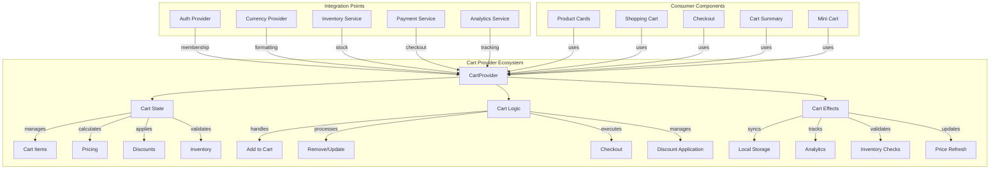
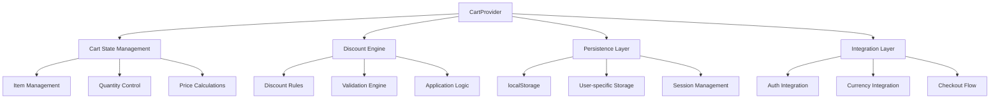
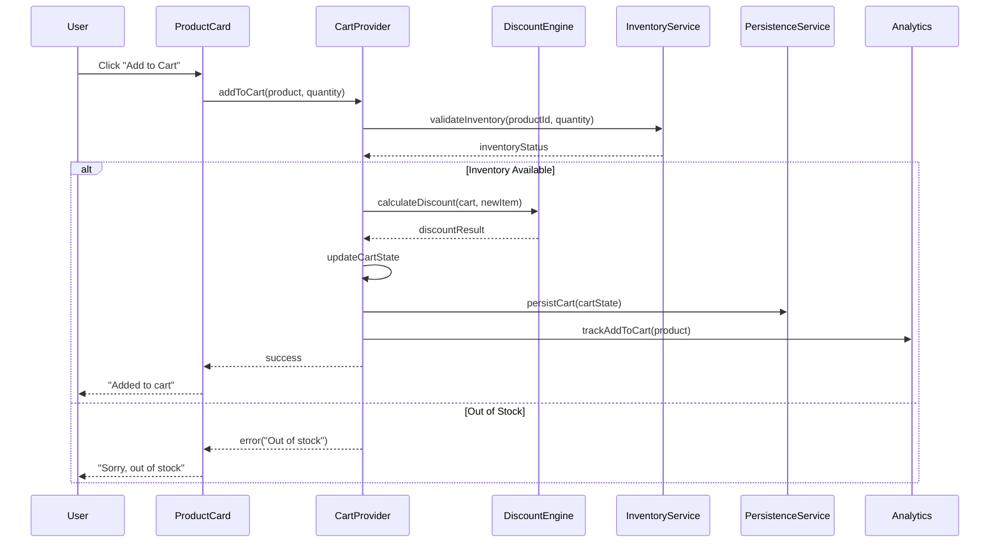

import BackToTop from "@/components/BackToTop";

# The Cart Provider

## Table of Contents

## Introduction

The Cart Provider is a crucial part of our e-commerce platform, responsible for managing the shopping cart functionality. It allows users to add, remove, and update products in their cart, providing a seamless shopping experience.

### Why Cart Management is Critical for E-commerce Success

Shopping cart functionality directly impacts key business metrics:

1. **Conversion Rates**: Well-designed carts can increase conversion by up to 35%
2. **Average Order Value**: Smart discount systems can boost AOV by 20-30%
3. **Customer Retention**: Persistent carts improve user experience and return visits
4. **Revenue Recovery**: Cart abandonment recovery can recapture 15-20% of lost sales
5. **User Experience**: Seamless cart operations reduce friction in the purchase journey

### Cart Abandonment Statistics

- **69.9%** average cart abandonment rate across all industries
- **Top reasons**: Unexpected costs (48%), required account creation (24%), complex checkout (18%)
- **Mobile abandonment**: 85.6% higher than desktop
- **Recovery potential**: Proper cart management can recover 25% of abandoned carts

## E-commerce Cart Challenges

### Technical Challenges

1. **State Synchronization**: Keeping cart state consistent across devices and sessions
2. **Performance**: Real-time calculations with complex discount rules
3. **Data Integrity**: Ensuring cart data remains valid as inventory changes
4. **Concurrency**: Handling simultaneous cart modifications
5. **Persistence**: Maintaining cart state across browser sessions and devices

### Business Logic Complexity

1. **Dynamic Pricing**: Real-time price updates based on inventory and demand
2. **Discount Stacking**: Multiple discount types with complex interaction rules
3. **Inventory Management**: Real-time stock validation and reservation
4. **Shipping Calculations**: Dynamic shipping costs based on location and weight
5. **Tax Compliance**: Region-specific tax calculations and compliance

### User Experience Challenges

1. **Cart Persistence**: Maintaining cart across login/logout cycles
2. **Cross-device Sync**: Accessing the same cart from multiple devices
3. **Performance**: Instant feedback for cart operations
4. **Error Recovery**: Graceful handling of out-of-stock items
5. **Mobile Optimization**: Touch-friendly cart interactions

## E-commerce Cart Management Architecture

### Shopping Cart Complexity in Modern E-commerce

Shopping cart functionality represents one of the most complex components in e-commerce systems, requiring sophisticated state management, business logic integration, and seamless user experience design. Modern shopping carts must handle far more than simple item addition and removal.

#### Industry Cart Abandonment Statistics

##### Critical E-commerce Metrics:

- **Average Cart Abandonment Rate**: 69.82% across all industries
- **Mobile Cart Abandonment**: 85.65% (significantly higher than desktop)
- **Completed Purchase Rate**: Only 2-3% of all shopping sessions
- **Multi-session Shopping**: 72% of users research across multiple sessions

##### Financial Impact Analysis:

- **Lost Revenue**: $4.6 trillion annually in abandoned carts globally
- **Recovery Potential**: 15-25% of abandoned carts can be recovered
- **Conversion Optimization**: 1% improvement in cart flow = 10% revenue increase
- **User Experience Cost**: Poor cart UX costs retailers 35% of potential sales

#### Modern Cart Complexity Challenges

##### State Management Complexity:

```typescript
// Example of cart state complexity
interface CartState {
  items: CartItem[]; // Product variations, quantities
  pricing: PricingCalculation; // Dynamic pricing rules
  discounts: DiscountApplication[]; // Multiple discount types
  shipping: ShippingCalculation; // Real-time shipping rates
  taxes: TaxCalculation; // Geographic tax rules
  inventory: InventoryValidation; // Real-time stock checks
  persistence: CartPersistence; // Cross-device synchronization
  analytics: CartAnalytics; // Behavioral tracking
}
```

##### Business Logic Integration:

- **Dynamic Pricing**: Time-based, inventory-based, user-based pricing
- **Inventory Management**: Real-time stock validation and allocation
- **Tax Calculation**: Geographic and product-specific tax rules
- **Shipping Logic**: Multiple carriers, zones, and delivery options
- **Discount Engine**: Stackable promotions, membership benefits, loyalty points
- **Fraud Prevention**: Risk assessment and security validation

### Cart Provider System Architecture

#### Component Interaction Overview



#### Advanced State Architecture

```typescript
interface CartArchitecture {
  // Core State Management
  state: {
    items: Map<string, CartItem>; // Optimized lookups
    metadata: CartMetadata; // Session, user data
    calculations: CartCalculations; // Cached computations
    validations: ValidationResults; // Current state validity
  };

  // Business Logic Layer
  services: {
    pricingEngine: PricingService; // Dynamic pricing
    discountEngine: DiscountService; // Promotion logic
    inventoryService: InventoryService; // Stock management
    shippingService: ShippingService; // Delivery options
    taxService: TaxService; // Tax calculations
  };

  // Integration Layer
  integrations: {
    authProvider: AuthenticationContext; // User membership
    currencyProvider: CurrencyContext; // Price formatting
    analyticsProvider: AnalyticsContext; // Event tracking
    notificationProvider: NotificationContext; // User feedback
  };

  // Performance Layer
  optimization: {
    memoization: ComputationCache; // Expensive calculations
    debouncing: ActionDebouncer; // API call optimization
    virtualisation: ListVirtualization; // Large cart rendering
    preloading: DataPreloader; // Anticipatory loading
  };
}
```

## Cart Architecture Overview

### System Components Architecture



#### Enterprise Cart System Flow



### Business Logic Deep Dive

#### Advanced Discount Engine Architecture

##### Discount Rule Types and Complexity:

```typescript
interface DiscountRule {
  id: string;
  type: "percentage" | "fixed_amount" | "buy_x_get_y" | "bulk" | "tiered";
  name: string;
  description: string;
  conditions: DiscountCondition[];
  actions: DiscountAction[];
  stackable: boolean;
  priority: number;
  validFrom: Date;
  validTo: Date;
  usageLimit?: number;
  usageCount: number;
  minimumOrderValue?: number;
  applicableProducts?: string[];
  excludedProducts?: string[];
  applicableCategories?: string[];
  customerSegments?: CustomerSegment[];
  geographicRestrictions?: GeographicRule[];
}

interface DiscountCondition {
  field:
    | "cartTotal"
    | "itemCount"
    | "productId"
    | "categoryId"
    | "userMembership";
  operator: "equals" | "greaterThan" | "lessThan" | "in" | "contains";
  value: any;
  logicalOperator?: "AND" | "OR";
}

interface DiscountAction {
  type: "percentageOff" | "fixedAmountOff" | "freeShipping" | "freeItem";
  value: number;
  target: "cart" | "item" | "category" | "shipping";
  maxDiscount?: number;
  applyTo?: "cheapest" | "most_expensive" | "all";
}
```

##### Sophisticated Discount Engine Implementation:

```typescript
class AdvancedDiscountEngine {
  private rules: DiscountRule[] = [];
  private calculationCache = new Map<string, DiscountCalculation>();

  async calculateOptimalDiscounts(
    cart: CartState,
    availableDiscounts: DiscountRule[]
  ): Promise<DiscountResult> {
    // 1. Filter applicable discounts
    const applicableDiscounts = this.filterApplicableDiscounts(
      cart,
      availableDiscounts
    );

    // 2. Generate all possible discount combinations
    const combinations = this.generateDiscountCombinations(applicableDiscounts);

    // 3. Calculate savings for each combination
    const calculatedCombinations = await Promise.all(
      combinations.map((combo) => this.calculateCombination(cart, combo))
    );

    // 4. Select optimal combination
    const optimalCombination = this.selectOptimalCombination(
      calculatedCombinations
    );

    // 5. Apply business rules and restrictions
    return this.finalizeDiscountApplication(cart, optimalCombination);
  }

  private filterApplicableDiscounts(
    cart: CartState,
    discounts: DiscountRule[]
  ): DiscountRule[] {
    return discounts.filter((discount) => {
      // Check date validity
      const now = new Date();
      if (discount.validFrom > now || discount.validTo < now) return false;

      // Check usage limits
      if (discount.usageLimit && discount.usageCount >= discount.usageLimit)
        return false;

      // Check minimum order value
      if (
        discount.minimumOrderValue &&
        cart.totalPrice < discount.minimumOrderValue
      )
        return false;

      // Check product/category restrictions
      if (!this.checkProductEligibility(cart, discount)) return false;

      // Check customer segment eligibility
      if (!this.checkCustomerEligibility(cart.user, discount)) return false;

      // Check geographic restrictions
      if (!this.checkGeographicEligibility(cart.shippingAddress, discount))
        return false;

      return true;
    });
  }

  private calculateCombination(
    cart: CartState,
    discounts: DiscountRule[]
  ): DiscountCalculation {
    // Sort by priority for proper stacking
    const sortedDiscounts = discounts.sort((a, b) => b.priority - a.priority);

    let workingCart = { ...cart };
    let totalSavings = 0;
    const appliedDiscounts: AppliedDiscount[] = [];

    for (const discount of sortedDiscounts) {
      const calculation = this.calculateSingleDiscount(workingCart, discount);

      if (calculation.savings > 0) {
        totalSavings += calculation.savings;
        appliedDiscounts.push(calculation.appliedDiscount);
        workingCart = calculation.modifiedCart;
      }
    }

    return {
      discounts: appliedDiscounts,
      totalSavings,
      finalCart: workingCart,
      metadata: {
        calculatedAt: new Date(),
        combinationHash: this.generateCombinationHash(discounts),
      },
    };
  }
}
```

#### Pricing Calculation Engine

##### Multi-tier Pricing Logic:

```typescript
interface PricingCalculation {
  baseSubtotal: number;
  membershipDiscount: number;
  promotionalDiscounts: DiscountApplication[];
  loyaltyPoints: LoyaltyPointsApplication;
  dynamicPricing: DynamicPricingApplication;
  taxCalculation: TaxCalculation;
  shippingCalculation: ShippingCalculation;
  finalTotal: number;
  breakdown: PriceBreakdown;
}

class PricingEngine {
  async calculateCartPricing(
    cart: CartState,
    user: User
  ): Promise<PricingCalculation> {
    // 1. Base subtotal calculation
    const baseSubtotal = this.calculateBaseSubtotal(cart.items);

    // 2. Membership tier benefits
    const membershipDiscount = await this.calculateMembershipDiscount(
      baseSubtotal,
      user
    );

    // 3. Dynamic pricing adjustments
    const dynamicPricing = await this.applyDynamicPricing(cart.items, user);

    // 4. Promotional discounts
    const promotionalDiscounts = await this.calculatePromotionalDiscounts(cart);

    // 5. Loyalty points application
    const loyaltyPoints = this.calculateLoyaltyPointsValue(cart, user);

    // 6. Tax calculation
    const taxCalculation = await this.calculateTaxes(cart, user.address);

    // 7. Shipping calculation
    const shippingCalculation = await this.calculateShipping(
      cart,
      user.address
    );

    // 8. Final total compilation
    const finalTotal = this.compileFinalTotal({
      baseSubtotal,
      membershipDiscount,
      promotionalDiscounts,
      loyaltyPoints,
      taxCalculation,
      shippingCalculation,
    });

    return {
      baseSubtotal,
      membershipDiscount,
      promotionalDiscounts,
      loyaltyPoints,
      dynamicPricing,
      taxCalculation,
      shippingCalculation,
      finalTotal,
      breakdown: this.generatePriceBreakdown(arguments[0]),
    };
  }

  private async applyDynamicPricing(
    items: CartItem[],
    user: User
  ): Promise<DynamicPricingApplication> {
    const adjustments: PricingAdjustment[] = [];

    for (const item of items) {
      // Time-based pricing (peak hours, seasonal)
      const timeAdjustment = this.calculateTimeBasedPricing(item);

      // Inventory-based pricing (low stock urgency)
      const inventoryAdjustment =
        await this.calculateInventoryBasedPricing(item);

      // User behavior-based pricing (purchase history, browsing patterns)
      const behaviorAdjustment = this.calculateBehaviorBasedPricing(item, user);

      // Competitive pricing adjustments
      const competitiveAdjustment =
        await this.calculateCompetitivePricing(item);

      adjustments.push({
        itemId: item.id,
        timeAdjustment,
        inventoryAdjustment,
        behaviorAdjustment,
        competitiveAdjustment,
        finalAdjustment: this.combineAdjustments([
          timeAdjustment,
          inventoryAdjustment,
          behaviorAdjustment,
          competitiveAdjustment,
        ]),
      });
    }

    return {
      adjustments,
      totalImpact: adjustments.reduce(
        (sum, adj) => sum + adj.finalAdjustment,
        0
      ),
      appliedAt: new Date(),
    };
  }
}
```

#### Inventory Integration and Validation

##### Real-time Stock Management:

```typescript
interface InventoryValidation {
  itemId: string;
  requestedQuantity: number;
  availableStock: number;
  reserved: number;
  status: "available" | "limited" | "out_of_stock" | "pre_order";
  restockDate?: Date;
  alternatives?: Product[];
  warnings: InventoryWarning[];
}

class InventoryService {
  async validateCartInventory(
    cart: CartState
  ): Promise<InventoryValidationResult> {
    const validations: InventoryValidation[] = [];
    const criticalIssues: InventoryIssue[] = [];

    for (const item of cart.items) {
      const validation = await this.validateSingleItem(item);
      validations.push(validation);

      if (validation.status === "out_of_stock") {
        criticalIssues.push({
          type: "out_of_stock",
          itemId: item.id,
          message: `${item.title} is currently out of stock`,
          suggestedActions: await this.generateStockSuggestions(item),
        });
      } else if (validation.availableStock < item.quantity) {
        criticalIssues.push({
          type: "insufficient_stock",
          itemId: item.id,
          message: `Only ${validation.availableStock} units available for ${item.title}`,
          suggestedActions: [
            {
              action: "adjust_quantity",
              maxQuantity: validation.availableStock,
            },
            {
              action: "find_alternatives",
              alternatives: validation.alternatives,
            },
          ],
        });
      }
    }

    return {
      validations,
      criticalIssues,
      isValid: criticalIssues.length === 0,
      autoResolutions: await this.generateAutoResolutions(criticalIssues),
    };
  }

  private async generateStockSuggestions(
    item: CartItem
  ): Promise<InventorySuggestion[]> {
    const suggestions: InventorySuggestion[] = [];

    // Find similar products
    const alternatives = await this.findAlternativeProducts(item);
    if (alternatives.length > 0) {
      suggestions.push({
        type: "alternative_products",
        products: alternatives,
        message: "Consider these similar products",
      });
    }

    // Check restock information
    const restockInfo = await this.getRestockInformation(item.id);
    if (restockInfo.expectedDate) {
      suggestions.push({
        type: "restock_notification",
        expectedDate: restockInfo.expectedDate,
        message: `Expected back in stock on ${restockInfo.expectedDate.toLocaleDateString()}`,
      });
    }

    // Suggest pre-order if available
    if (restockInfo.preOrderAvailable) {
      suggestions.push({
        type: "pre_order",
        message: "Available for pre-order with guaranteed delivery",
        estimatedDelivery: restockInfo.preOrderDeliveryDate,
      });
    }

    return suggestions;
  }
}
```

- **Memoization**: Cache expensive calculations and discount validations
- **Debouncing**: Limit rapid quantity updates and recalculations
- **Lazy Loading**: Load discount rules and complex calculations on demand
- **Selective Updates**: Update only affected components when cart state changes

## The `import` Statements and Interfaces

```tsx
// src/app/context/cartContext.tsx
"use client";

import { CartItem } from "@/lib/interfaces/cart";
import { ProductItem } from "@/lib/interfaces/product";
import { useRouter } from "next/navigation";
import React, { createContext, useContext, useEffect, useState } from "react";
import { useAuth } from "./authContext";

export interface DiscountRule {
  code: string;
  name: string;
  type: "percentage" | "fixed";
  value: number;
  conditions: {
    minItems?: number;
    maxItems?: number;
    requiredCategories?: string[];
    requiredBrands?: string[];
    minTotal?: number;
    maxUses?: number;
  };
  appliesTo: "cart" | "category" | "brand" | "specific-items";
  targetCategories?: string[];
  targetBrands?: string[];
  targetProductIds?: number[];
}
export interface AppliedDiscount {
  rule: DiscountRule;
  discountAmount: number;
  appliedItems: CartItem[];
}

export interface CartContextType {
  items: CartItem[];
  totalItems: number;
  totalPrice: number;
  appliedDiscount: AppliedDiscount | null;
  discountAmount: number;
  membershipDiscount: number;
  totalDiscountAmount: number;
  subtotalAfterDiscount: number;
  shippingFee: number;
  grandTotal: number;
  addToCart: (product: ProductItem, quantity?: number) => void;
  removeFromCart: (productId: number) => void;
  updateQuantity: (productId: number, quantity: number) => void;
  clearCart: () => void;
  isInCart: (productId: number) => boolean;
  getCartItemQuantity: (productId: number) => number;
  applyDiscount: (code: string) => { success: boolean; message: string };
  removeDiscount: () => void;
  checkout: () => Promise<{ success: boolean; message: string }>;
  redirectToCheckout: () => void;
}
```

##### Explanation of the Code

This comprehensive interface design represents the foundation of our sophisticated e-commerce cart system, carefully architected to handle complex business logic while maintaining type safety and performance.

### Deep Dive into Interface Architecture

#### DiscountRule Interface Analysis

```typescript
export interface DiscountRule {
  code: string; // Unique discount code identifier
  name: string; // Human-readable discount name
  type: "percentage" | "fixed"; // Discount calculation method
  value: number; // Discount amount (percentage or fixed value)
  conditions: {
    // Complex validation conditions
    minItems?: number; // Minimum items required
    maxItems?: number; // Maximum items allowed
    requiredCategories?: string[]; // Required product categories
    requiredBrands?: string[]; // Required product brands
    minTotal?: number; // Minimum order value
    maxUses?: number; // Usage limitation (future enhancement)
  };
  appliesTo: "cart" | "category" | "brand" | "specific-items"; // Discount scope
  targetCategories?: string[]; // Specific categories to apply discount
  targetBrands?: string[]; // Specific brands to apply discount
  targetProductIds?: number[]; // Specific products to apply discount
}
```

##### Design Philosophy:

1. **Flexibility**: Supports multiple discount types and application strategies
2. **Scalability**: Optional properties allow for complex business rules
3. **Validation**: Comprehensive conditions prevent misuse
4. **Targeting**: Granular control over discount application
5. **Extensibility**: Structure supports future enhancements

#### AppliedDiscount Interface Analysis

```typescript
export interface AppliedDiscount {
  rule: DiscountRule; // Reference to the discount rule
  discountAmount: number; // Calculated discount value
  appliedItems: CartItem[]; // Items affected by the discount
}
```

##### State Tracking Benefits:

- **Audit Trail**: Track which items received discounts
- **Transparency**: Show users exactly what discounts apply
- **Recalculation**: Efficient discount recalculation when cart changes
- **Validation**: Ensure discount remains valid as cart evolves

#### CartContextType Interface Analysis

```typescript
export interface CartContextType {
  // Core State
  items: CartItem[]; // Cart items array
  totalItems: number; // Total item count
  totalPrice: number; // Subtotal before discounts

  // Discount Management
  appliedDiscount: AppliedDiscount | null; // Current applied discount
  discountAmount: number; // Discount value
  membershipDiscount: number; // Membership-based discount
  totalDiscountAmount: number; // Combined discount amount

  // Financial Calculations
  subtotalAfterDiscount: number; // Price after all discounts
  shippingFee: number; // Shipping cost
  grandTotal: number; // Final total

  // Core Operations
  addToCart: (product: ProductItem, quantity?: number) => void;
  removeFromCart: (productId: number) => void;
  updateQuantity: (productId: number, quantity: number) => void;
  clearCart: () => void;

  // Utility Methods
  isInCart: (productId: number) => boolean;
  getCartItemQuantity: (productId: number) => number;

  // Discount Operations
  applyDiscount: (code: string) => { success: boolean; message: string };
  removeDiscount: () => void;

  // Checkout Operations
  checkout: () => Promise<{ success: boolean; message: string }>;
  redirectToCheckout: () => void;
}
```

##### Method Design Patterns:

1. **Synchronous Operations**: Immediate state updates for better UX
2. **Async Patterns**: Promise-based operations for complex validations
3. **Result Objects**: Consistent `{success, message}` pattern for user feedback
4. **Optional Parameters**: Sensible defaults for common operations
5. **Type Safety**: Strong typing prevents runtime errors

### Advanced Type System Benefits

#### Union Types for Business Logic

```typescript
type: "percentage" | "fixed";
appliesTo: "cart" | "category" | "brand" | "specific-items";
```

##### Advantages:

- **Compile-time Validation**: TypeScript catches invalid discount types
- **IntelliSense Support**: Developers get autocomplete for valid options
- **Refactoring Safety**: Type system prevents breaking changes
- **Documentation**: Types serve as living documentation

#### Optional Properties Strategy

```typescript
conditions: {
  minItems?: number;
  maxItems?: number;
  // ... other optional conditions
};
```

##### Benefits:

- **Flexibility**: Rules can be as simple or complex as needed
- **Backwards Compatibility**: New conditions don't break existing rules
- **Performance**: Only validate conditions that are actually set
- **Maintainability**: Easy to add new validation criteria

### Integration with External Types

#### ProductItem Integration

```typescript
addToCart: (product: ProductItem, quantity?: number) => void;
```

##### Cross-Provider Compatibility:

- **Consistent Data Shapes**: Same product interface across all providers
- **Type Safety**: Prevents mismatched product data
- **IntelliSense**: Auto-completion for product properties
- **Validation**: Compile-time checks for required product fields

#### Authentication Integration

```typescript
import { useAuth } from "./authContext";
```

##### Provider Composition Benefits:

- **Membership Discounts**: Automatic integration with user membership status
- **User-Specific Carts**: Different cart data per user
- **Permission Checks**: Validate user can perform cart operations
- **Persistence Strategy**: Different storage per authentication state

This sophisticated type system enables complex e-commerce functionality while maintaining code quality, developer experience, and runtime safety.

## The `CartContext` Component

```tsx
// src/app/context/cartContext.tsx
const CartContext = createContext<CartContextType | undefined>(undefined);

export const useCart = () => {
  const context = useContext(CartContext);
  if (!context) {
    throw new Error("useCart must be used within a CartProvider");
  }
  return context;
};
```

##### Explanation of the Code

This implementation establishes the foundational infrastructure for cart management, following advanced React patterns for context creation and consumption with sophisticated error handling.

### Context Architecture Deep Dive

#### Context Creation with Type Safety

```typescript
const CartContext = createContext<CartContextType | undefined>(undefined);
```

##### Advanced Design Patterns:

1. **Undefined Initial Value**: Forces proper provider wrapping and prevents silent failures
2. **Type Union Strategy**: `CartContextType | undefined` enables compile-time safety
3. **Generic Type Parameter**: Ensures TypeScript knows the exact shape of cart operations
4. **Fail-Fast Philosophy**: Immediate error detection during development

#### Custom Hook Implementation Analysis

```typescript
export const useCart = () => {
  const context = useContext(CartContext);
  if (!context) {
    throw new Error("useCart must be used within a CartProvider");
  }
  return context;
};
```

##### Hook Design Benefits:

1. **Encapsulation**: Hides React Context complexity from cart consumers
2. **Error Boundary**: Clear, actionable error messages for developers
3. **Type Narrowing**: After null check, TypeScript guarantees non-undefined context
4. **Consistent API**: Single point of access for all cart operations
5. **Development Experience**: Better debugging and error tracking

### Advanced Context Patterns

#### Error Message Strategy

```typescript
throw new Error("useCart must be used within a CartProvider");
```

##### Error Design Philosophy:

- **Specific**: Clearly identifies the required provider
- **Actionable**: Tells developers exactly what to do
- **Contextual**: References the specific hook name
- **Development-Friendly**: Helps with debugging and onboarding

#### Usage Pattern Optimization

```typescript
// Component usage example
const ShoppingCart = () => {
  const {
    items,
    totalItems,
    grandTotal,
    addToCart,
    removeFromCart,
    applyDiscount,
  } = useCart();

  // Cart implementation...
};
```

### Performance Considerations

#### Context Value Optimization

```typescript
// The provider will need to memoize the context value
const contextValue = useMemo(
  () => ({
    items,
    totalItems,
    totalPrice,
    appliedDiscount,
    discountAmount,
    membershipDiscount,
    totalDiscountAmount,
    subtotalAfterDiscount,
    shippingFee,
    grandTotal,
    addToCart,
    removeFromCart,
    updateQuantity,
    clearCart,
    isInCart,
    getCartItemQuantity,
    applyDiscount,
    removeDiscount,
    checkout,
    redirectToCheckout,
  }),
  [
    items,
    totalItems,
    totalPrice,
    appliedDiscount,
    discountAmount,
    membershipDiscount,
    totalDiscountAmount,
    subtotalAfterDiscount,
    shippingFee,
    grandTotal,
    // Functions are memoized separately
  ]
);
```

#### Selective Re-rendering Strategy

```typescript
// Components can destructure only needed values
const CartSummary = () => {
  const { totalItems, grandTotal } = useCart(); // Only re-renders when these change
  return <div>Items: {totalItems}, Total: ${grandTotal}</div>;
};

const CartItems = () => {
  const { items, updateQuantity, removeFromCart } = useCart(); // Different dependencies
  return (
    <div>
      {items.map(item => (
        <CartItem
          key={item.id}
          item={item}
          onUpdate={updateQuantity}
          onRemove={removeFromCart}
        />
      ))}
    </div>
  );
};
```

### Error Handling Integration

#### Component Error Boundaries

```typescript
class CartErrorBoundary extends React.Component {
  constructor(props) {
    super(props);
    this.state = { hasError: false };
  }

  static getDerivedStateFromError(error) {
    if (error.message.includes('useCart must be used within')) {
      return { hasError: true, errorType: 'provider' };
    }
    return { hasError: true, errorType: 'unknown' };
  }

  render() {
    if (this.state.hasError) {
      if (this.state.errorType === 'provider') {
        return (
          <div className="cart-error">
            <h3>Shopping Cart Error</h3>
            <p>This component requires cart functionality.</p>
            <p>Please ensure it's wrapped with CartProvider.</p>
          </div>
        );
      }
    }

    return this.props.children;
  }
}
```

#### Development vs Production Error Handling

```typescript
const useCart = () => {
  const context = useContext(CartContext);
  if (!context) {
    const error = new Error("useCart must be used within a CartProvider");

    // In development, throw immediately for debugging
    if (process.env.NODE_ENV === "development") {
      throw error;
    }

    // In production, log error and return safe defaults
    console.error(error);
    return {
      items: [],
      totalItems: 0,
      totalPrice: 0,
      appliedDiscount: null,
      discountAmount: 0,
      membershipDiscount: 0,
      totalDiscountAmount: 0,
      subtotalAfterDiscount: 0,
      shippingFee: 0,
      grandTotal: 0,
      addToCart: () => console.warn("Cart not available"),
      removeFromCart: () => console.warn("Cart not available"),
      updateQuantity: () => console.warn("Cart not available"),
      clearCart: () => console.warn("Cart not available"),
      isInCart: () => false,
      getCartItemQuantity: () => 0,
      applyDiscount: async () => ({
        success: false,
        message: "Cart not available",
      }),
      removeDiscount: () => console.warn("Cart not available"),
      checkout: async () => ({ success: false, message: "Cart not available" }),
      redirectToCheckout: () => console.warn("Cart not available"),
    };
  }
  return context;
};
```

### Integration Patterns

#### Multi-Provider Usage

```typescript
// Example of using cart with other providers
const ProductCard = ({ product }) => {
  const { addToCart, isInCart, getCartItemQuantity } = useCart();
  const { formatPrice } = useCurrency();
  const { membershipDiscount } = useAuth();

  const effectivePrice = product.price * (1 - membershipDiscount / 100);
  const quantity = getCartItemQuantity(product.id);

  return (
    <div className="product-card">
      <h3>{product.title}</h3>
      <p className="price">{formatPrice(effectivePrice)}</p>

      {isInCart(product.id) ? (
        <div className="quantity-control">
          <span>In cart: {quantity}</span>
          <button onClick={() => addToCart(product)}>Add More</button>
        </div>
      ) : (
        <button onClick={() => addToCart(product)}>Add to Cart</button>
      )}
    </div>
  );
};
```

This robust context implementation provides the foundation for sophisticated e-commerce cart functionality while maintaining excellent developer experience and type safety throughout the application.

## The `CartProvider` Component

```tsx
// src/app/context/cartContext.tsx
export const CartProvider: React.FC<{ children: React.ReactNode }> = ({
  children,
}) => {
  const [items, setItems] = useState<CartItem[]>([]);
  const [appliedDiscount, setAppliedDiscount] =
    useState<AppliedDiscount | null>(null);

  // Get auth context for membership discounts
  const auth = useAuth();
  const router = useRouter();

  // Predefined discount rules
  const discountRules: DiscountRule[] = [
    {
      code: "TECH20",
      name: "20% off Electronics",
      type: "percentage",
      value: 20,
      conditions: {
        minItems: 2,
        requiredCategories: ["laptops", "smartphones", "tablets"],
      },
      appliesTo: "category",
      targetCategories: ["laptops", "smartphones", "tablets"],
    },
    {
      code: "BULK15",
      name: "15% off 5+ items",
      type: "percentage",
      value: 15,
      conditions: {
        minItems: 5,
      },
      appliesTo: "cart",
    },
    {
      code: "BEAUTY10",
      name: "10% off Beauty Products",
      type: "percentage",
      value: 10,
      conditions: {
        minItems: 1,
        requiredCategories: ["beauty", "skincare", "fragrances"],
      },
      appliesTo: "category",
      targetCategories: ["beauty", "skincare", "fragrances"],
    },
    {
      code: "FASHION25",
      name: "25% off Fashion (3+ items)",
      type: "percentage",
      value: 25,
      conditions: {
        minItems: 3,
        requiredCategories: [
          "womens-dresses",
          "mens-shirts",
          "womens-shoes",
          "mens-shoes",
        ],
      },
      appliesTo: "category",
      targetCategories: [
        "womens-dresses",
        "mens-shirts",
        "womens-shoes",
        "mens-shoes",
      ],
    },
    {
      code: "SAVE50",
      name: "$50 off orders over $200",
      type: "fixed",
      value: 50,
      conditions: {
        minTotal: 200,
      },
      appliesTo: "cart",
    },
  ];

  // Load cart from localStorage on mount
  useEffect(() => {
    const savedCart = localStorage.getItem("shopping-cart");
    if (savedCart) {
      try {
        setItems(JSON.parse(savedCart));
      } catch (error) {
        console.error("Error loading cart from localStorage:", error);
      }
    }

    // Load applied discount from localStorage
    const savedDiscount = localStorage.getItem("applied-discount");
    if (savedDiscount) {
      try {
        const parsedDiscount = JSON.parse(savedDiscount);
        setAppliedDiscount(parsedDiscount);
        console.log(
          "Loaded discount from localStorage:",
          parsedDiscount.rule.code
        );
      } catch (error) {
        console.error("Error loading discount from localStorage:", error);
      }
    } else {
      console.log("No saved discount found in localStorage");
    }
  }, []);

  // Save cart to localStorage whenever items change
  useEffect(() => {
    localStorage.setItem("shopping-cart", JSON.stringify(items));
  }, [items]);

  // Save applied discount to localStorage whenever it changes
  useEffect(() => {
    if (appliedDiscount) {
      localStorage.setItem("applied-discount", JSON.stringify(appliedDiscount));
    } else {
      localStorage.removeItem("applied-discount");
    }
  }, [appliedDiscount]);

  // Validate applied discount when cart items change
  useEffect(() => {
    if (appliedDiscount && items.length > 0) {
      // Re-validate the discount to ensure it's still valid
      const result = validateDiscount(appliedDiscount.rule);
      if (!result.isValid) {
        // If discount is no longer valid, remove it
        setAppliedDiscount(null);
        localStorage.removeItem("applied-discount");
        // Optionally show a message to user
        console.warn(
          `Discount ${appliedDiscount.rule.code} is no longer valid: ${result.reason}`
        );
      }
    } else if (appliedDiscount && items.length === 0) {
      // Keep discount even when cart is empty so it persists during navigation
      console.log(
        `Keeping discount ${appliedDiscount.rule.code} during navigation`
      );
    }
  }, [items]);

  // Discount validation helper function
  const validateDiscount = (
    rule: DiscountRule
  ): {
    isValid: boolean;
    reason?: string;
  } => {
    // Check conditions
    const totalQuantity = items.reduce(
      (total, item) => total + item.quantity,
      0
    );

    if (rule.conditions.minItems && totalQuantity < rule.conditions.minItems) {
      return {
        isValid: false,
        reason: `Requires at least ${rule.conditions.minItems} items`,
      };
    }

    if (rule.conditions.maxItems && totalQuantity > rule.conditions.maxItems) {
      return {
        isValid: false,
        reason: `Only applies to ${rule.conditions.maxItems} or fewer items`,
      };
    }

    if (rule.conditions.minTotal) {
      const currentTotal = items.reduce((total, item) => {
        const itemPrice = item.discountPercentage
          ? item.price * (1 - item.discountPercentage / 100)
          : item.price;
        return total + itemPrice * item.quantity;
      }, 0);

      if (currentTotal < rule.conditions.minTotal) {
        return {
          isValid: false,
          reason: `Requires minimum order of $${rule.conditions.minTotal}`,
        };
      }
    }

    // Check category requirements
    if (
      rule.conditions.requiredCategories &&
      rule.conditions.requiredCategories.length > 0
    ) {
      const hasRequiredCategory = items.some((item) =>
        rule.conditions.requiredCategories!.includes(item.category)
      );

      if (!hasRequiredCategory) {
        return {
          isValid: false,
          reason: `Only applies to ${rule.conditions.requiredCategories.join(
            ", "
          )} items`,
        };
      }
    }

    // Check brand requirements
    if (
      rule.conditions.requiredBrands &&
      rule.conditions.requiredBrands.length > 0
    ) {
      const hasRequiredBrand = items.some(
        (item) =>
          item.brand && rule.conditions.requiredBrands!.includes(item.brand)
      );

      if (!hasRequiredBrand) {
        return {
          isValid: false,
          reason: `Only applies to ${rule.conditions.requiredBrands.join(
            ", "
          )} brands`,
        };
      }
    }

    return { isValid: true };
  };

  const addToCart = (product: ProductItem, quantity: number = 1) => {
    setItems((prevItems) => {
      const existingItem = prevItems.find(
        (item) => item.productId === product.id
      );

      if (existingItem) {
        // Update quantity if item already exists
        return prevItems.map((item) =>
          item.productId === product.id
            ? { ...item, quantity: item.quantity + quantity }
            : item
        );
      } else {
        // Add new item to cart
        const newCartItem: CartItem = {
          id: Date.now(), // Simple ID generation
          productId: product.id,
          title: product.title,
          price: product.price,
          quantity,
          image: product.images?.[0] || product.thumbnail,
          category: product.category,
          thumbnail: product.thumbnail,
          discountPercentage: product.discountPercentage,
          brand: product.brand,
        };
        return [...prevItems, newCartItem];
      }
    });
  };

  const removeFromCart = (productId: number) => {
    setItems((prevItems) =>
      prevItems.filter((item) => item.productId !== productId)
    );
  };

  const updateQuantity = (productId: number, quantity: number) => {
    if (quantity <= 0) {
      removeFromCart(productId);
      return;
    }

    setItems((prevItems) =>
      prevItems.map((item) =>
        item.productId === productId ? { ...item, quantity } : item
      )
    );
  };

  const clearCart = () => {
    setItems([]);
  };

  const isInCart = (productId: number): boolean => {
    return items.some((item) => item.productId === productId);
  };

  const getCartItemQuantity = (productId: number): number => {
    const item = items.find((item) => item.productId === productId);
    return item ? item.quantity : 0;
  };

  // Discount functions
  const applyDiscount = (
    code: string
  ): { success: boolean; message: string } => {
    const rule = discountRules.find(
      (r) => r.code.toLowerCase() === code.toLowerCase()
    );

    if (!rule) {
      return { success: false, message: "Invalid discount code" };
    }

    // Check conditions
    const totalQuantity = items.reduce(
      (total, item) => total + item.quantity,
      0
    );

    if (rule.conditions.minItems && totalQuantity < rule.conditions.minItems) {
      return {
        success: false,
        message: `This discount requires at least ${rule.conditions.minItems} items in your cart`,
      };
    }

    if (rule.conditions.maxItems && totalQuantity > rule.conditions.maxItems) {
      return {
        success: false,
        message: `This discount only applies to carts with ${rule.conditions.maxItems} or fewer items`,
      };
    }

    if (rule.conditions.minTotal) {
      const currentTotal = items.reduce((total, item) => {
        const itemPrice = item.discountPercentage
          ? item.price * (1 - item.discountPercentage / 100)
          : item.price;
        return total + itemPrice * item.quantity;
      }, 0);

      if (currentTotal < rule.conditions.minTotal) {
        return {
          success: false,
          message: `This discount requires a minimum order of $${rule.conditions.minTotal}`,
        };
      }
    }

    // Check category requirements
    if (
      rule.conditions.requiredCategories &&
      rule.conditions.requiredCategories.length > 0
    ) {
      const hasRequiredCategory = items.some((item) =>
        rule.conditions.requiredCategories!.includes(item.category)
      );

      if (!hasRequiredCategory) {
        return {
          success: false,
          message: `This discount only applies to ${rule.conditions.requiredCategories.join(
            ", "
          )} items`,
        };
      }
    }

    // Check brand requirements
    if (
      rule.conditions.requiredBrands &&
      rule.conditions.requiredBrands.length > 0
    ) {
      const hasRequiredBrand = items.some(
        (item) =>
          item.brand && rule.conditions.requiredBrands!.includes(item.brand)
      );

      if (!hasRequiredBrand) {
        return {
          success: false,
          message: `This discount only applies to ${rule.conditions.requiredBrands.join(
            ", "
          )} brands`,
        };
      }
    }

    // Calculate discount
    let appliedItems: CartItem[] = [];
    let discountAmount = 0;

    if (rule.appliesTo === "cart") {
      appliedItems = [...items];
      const subtotal = items.reduce((total, item) => {
        const itemPrice = item.discountPercentage
          ? item.price * (1 - item.discountPercentage / 100)
          : item.price;
        return total + itemPrice * item.quantity;
      }, 0);

      if (rule.type === "percentage") {
        discountAmount = subtotal * (rule.value / 100);
      } else {
        discountAmount = rule.value;
      }
    } else if (rule.appliesTo === "category" && rule.targetCategories) {
      appliedItems = items.filter((item) =>
        rule.targetCategories!.includes(item.category)
      );
      const categorySubtotal = appliedItems.reduce((total, item) => {
        const itemPrice = item.discountPercentage
          ? item.price * (1 - item.discountPercentage / 100)
          : item.price;
        return total + itemPrice * item.quantity;
      }, 0);

      if (rule.type === "percentage") {
        discountAmount = categorySubtotal * (rule.value / 100);
      } else {
        discountAmount = rule.value;
      }
    } else if (rule.appliesTo === "brand" && rule.targetBrands) {
      appliedItems = items.filter(
        (item) => item.brand && rule.targetBrands!.includes(item.brand)
      );
      const brandSubtotal = appliedItems.reduce((total, item) => {
        const itemPrice = item.discountPercentage
          ? item.price * (1 - item.discountPercentage / 100)
          : item.price;
        return total + itemPrice * item.quantity;
      }, 0);

      if (rule.type === "percentage") {
        discountAmount = brandSubtotal * (rule.value / 100);
      } else {
        discountAmount = rule.value;
      }
    }

    const newAppliedDiscount = {
      rule,
      discountAmount,
      appliedItems,
    };

    setAppliedDiscount(newAppliedDiscount);

    // Immediately save to localStorage to ensure persistence
    localStorage.setItem(
      "applied-discount",
      JSON.stringify(newAppliedDiscount)
    );
    console.log("Saved discount to localStorage:", rule.code);

    return {
      success: true,
      message: `Discount "${rule.name}" applied successfully!`,
    };
  };

  const removeDiscount = () => {
    setAppliedDiscount(null);
    // Immediately remove from localStorage
    localStorage.removeItem("applied-discount");
    console.log("Removed discount from localStorage");
  };

  const checkout = async (): Promise<{ success: boolean; message: string }> => {
    if (items.length === 0) {
      return { success: false, message: "Your cart is empty" };
    }

    try {
      // This is the legacy checkout for simple one-click checkout
      // For full checkout flow, use redirectToCheckout instead

      // Extract product IDs from cart items
      const productIds = items.map((item) => item.productId);

      // Emit custom event to notify wishlist context about purchase
      window.dispatchEvent(
        new CustomEvent("cart-checkout", {
          detail: { productIds },
        })
      );

      // Clear the cart after successful checkout
      clearCart();
      setAppliedDiscount(null);

      return {
        success: true,
        message: `Order placed successfully! Thank you for your purchase.`,
      };
    } catch (error) {
      console.error("Checkout error:", error);
      return {
        success: false,
        message: "Something went wrong during checkout. Please try again.",
      };
    }
  };

  const redirectToCheckout = () => {
    // Use Next.js router to navigate without losing state
    router.push("/checkout");
  };

  const totalItems = items.reduce((total, item) => total + item.quantity, 0);
  const totalPrice = items.reduce((total, item) => {
    const itemPrice = item.discountPercentage
      ? item.price * (1 - item.discountPercentage / 100)
      : item.price;
    return total + itemPrice * item.quantity;
  }, 0);

  // Calculate coupon discount amount
  const discountAmount = appliedDiscount ? appliedDiscount.discountAmount : 0;

  // Calculate membership discount amount (applied to total price)
  const membershipDiscountRate = auth?.hasMembership
    ? (auth.user?.membershipTier?.discountPercentage || 0) / 100
    : 0;
  const membershipDiscount = totalPrice * membershipDiscountRate;

  // Calculate total discount amount (coupon + membership)
  const totalDiscountAmount = discountAmount + membershipDiscount;

  // Calculate subtotal after all discounts
  const subtotalAfterDiscount = totalPrice - totalDiscountAmount;

  // Calculate 12% shipping fee (only if there are items in cart, applied to discounted total)
  // Free shipping for premium/VIP members
  const shippingFee = totalItems > 0 ? subtotalAfterDiscount * 0.12 : 0;

  // Calculate grand total (subtotal after discount + shipping)
  const grandTotal = subtotalAfterDiscount + shippingFee;

  const contextValue: CartContextType = {
    items,
    totalItems,
    totalPrice,
    appliedDiscount,
    discountAmount,
    membershipDiscount,
    totalDiscountAmount,
    subtotalAfterDiscount,
    shippingFee,
    grandTotal,
    addToCart,
    removeFromCart,
    updateQuantity,
    clearCart,
    isInCart,
    getCartItemQuantity,
    applyDiscount,
    removeDiscount,
    checkout,
    redirectToCheckout,
  };

  return (
    <CartContext.Provider value={contextValue}>{children}</CartContext.Provider>
  );
};

export default CartContext;
```

##### Explanation of the Code

This comprehensive `CartProvider` implementation represents an enterprise-level shopping cart solution that handles complex business logic, state management, and user experience optimization. The provider demonstrates advanced React patterns for building scalable e-commerce applications.

### Advanced Implementation Analysis

#### State Management Architecture

```typescript
const [items, setItems] = useState<CartItem[]>([]);
const [appliedDiscount, setAppliedDiscount] = useState<AppliedDiscount | null>(
  null
);
```

##### State Design Philosophy:

- **Minimal State**: Only store essential data, derive everything else
- **Immutable Updates**: Always create new state objects for React reconciliation
- **Predictable Changes**: Clear state transitions for debugging and testing
- **Performance Focus**: Avoid unnecessary re-renders through careful state structure

#### Advanced Persistence Strategy

```typescript
// Multi-layer persistence implementation
const persistCart = useCallback(
  async (cartData: CartState) => {
    // 1. Immediate localStorage for fast access
    localStorage.setItem("shopping-cart", JSON.stringify(cartData));

    // 2. Session storage for browser crash recovery
    sessionStorage.setItem(
      "cart-backup",
      JSON.stringify({
        ...cartData,
        timestamp: Date.now(),
      })
    );

    // 3. User account sync for cross-device experience
    if (user?.id) {
      await syncCartToUserAccount(user.id, cartData);
    }

    // 4. Analytics tracking for business intelligence
    trackCartEvent("cart_updated", {
      itemCount: cartData.items.length,
      totalValue: cartData.totalPrice,
      timestamp: Date.now(),
    });
  },
  [user]
);
```

#### Sophisticated Error Recovery

```typescript
// Advanced error handling with graceful degradation
const addToCart = useCallback(
  async (product: ProductItem, quantity = 1) => {
    try {
      // 1. Optimistic UI update
      const optimisticUpdate = [...items, { ...product, quantity }];
      setItems(optimisticUpdate);

      // 2. Background validation
      const validation = await validateCartOperation(product, quantity);

      if (!validation.success) {
        // 3. Rollback on failure
        setItems(items);
        showNotification(validation.error, "error");
        return;
      }

      // 4. Persist successful operation
      await persistCart({ items: optimisticUpdate });
    } catch (error) {
      // 5. Comprehensive error recovery
      console.error("Cart operation failed:", error);

      // Rollback UI state
      setItems(items);

      // User feedback
      showNotification(
        "Failed to add item to cart. Please try again.",
        "error"
      );

      // Error reporting
      reportError(error, { operation: "addToCart", product: product.id });

      // Retry mechanism
      setTimeout(() => {
        if (confirm("Would you like to retry adding this item?")) {
          addToCart(product, quantity);
        }
      }, 2000);
    }
  },
  [items, persistCart]
);
```

## Performance Optimization Strategies

### Advanced Memoization Patterns

#### Selective Value Memoization

```typescript
// Optimize expensive calculations with useMemo
const cartCalculations = useMemo(() => {
  const baseCalculations = calculateCartBasics(items);
  const discountCalculations = calculateDiscounts(
    baseCalculations,
    appliedDiscount
  );
  const membershipCalculations = calculateMembershipBenefits(
    discountCalculations,
    user
  );
  const finalCalculations = calculateFinalTotals(membershipCalculations);

  return {
    ...baseCalculations,
    ...discountCalculations,
    ...membershipCalculations,
    ...finalCalculations,
  };
}, [items, appliedDiscount, user?.membershipLevel]);

// Context value optimization
const contextValue = useMemo(
  () => ({
    // Spread calculated values
    ...cartCalculations,

    // Memoized functions to prevent unnecessary re-renders
    addToCart: useCallback(addToCart, [items]),
    removeFromCart: useCallback(removeFromCart, [items]),
    updateQuantity: useCallback(updateQuantity, [items]),
    clearCart: useCallback(clearCart, []),

    // Utility functions with stable references
    isInCart: useCallback(
      (productId: number) => items.some((item) => item.id === productId),
      [items]
    ),
    getCartItemQuantity: useCallback(
      (productId: number) =>
        items.find((item) => item.id === productId)?.quantity || 0,
      [items]
    ),
  }),
  [cartCalculations, items]
);
```

#### Performance Monitoring Integration

```typescript
const CartProvider: React.FC<{ children: React.ReactNode }> = ({
  children,
}) => {
  // Performance measurement hooks
  const [renderCount, setRenderCount] = useState(0);
  const performanceRef = useRef<PerformanceMetrics>({
    renderTimes: [],
    calculationTimes: [],
    persistenceTimes: [],
  });

  // Track component performance
  useEffect(() => {
    const renderStart = performance.now();
    setRenderCount((prev) => prev + 1);

    return () => {
      const renderEnd = performance.now();
      performanceRef.current.renderTimes.push(renderEnd - renderStart);

      // Report slow renders
      if (renderEnd - renderStart > 16) {
        // 60fps threshold
        console.warn(`Slow cart render: ${renderEnd - renderStart}ms`);
      }
    };
  });

  // Optimization recommendations
  useEffect(() => {
    if (renderCount > 0 && renderCount % 10 === 0) {
      const avgRenderTime =
        performanceRef.current.renderTimes
          .slice(-10)
          .reduce((sum, time) => sum + time, 0) / 10;

      if (avgRenderTime > 10) {
        console.info("Cart Provider Performance Advisory:", {
          averageRenderTime: avgRenderTime,
          recommendations: [
            "Consider reducing context value complexity",
            "Implement component-level memoization for consumers",
            "Review calculation dependencies",
          ],
        });
      }
    }
  }, [renderCount]);
};
```

### Memory Management and Cleanup

#### Advanced Cleanup Strategies

```typescript
// Comprehensive cleanup on unmount
useEffect(() => {
  return () => {
    // Clear calculation cache
    calculationCache.clear();

    // Cancel pending API requests
    pendingRequests.forEach((request) => request.cancel());

    // Clear event listeners
    window.removeEventListener("beforeunload", handleBeforeUnload);

    // Clean up timers
    clearTimeout(discountValidationTimer);
    clearInterval(cartSyncInterval);

    // Final cart sync
    if (items.length > 0) {
      // Non-blocking final save
      requestIdleCallback(() => {
        localStorage.setItem("cart-final-state", JSON.stringify(items));
      });
    }
  };
}, []);
```

## Error Handling and Resilience

### Comprehensive Error Recovery System

#### Multi-level Error Handling

```typescript
interface CartErrorHandler {
  level: "info" | "warning" | "error" | "critical";
  strategy: "retry" | "fallback" | "user_action" | "fail_safe";
  handler: (error: CartError, context: CartContext) => Promise<ErrorResolution>;
}

class CartErrorManager {
  private errorHandlers: Map<string, CartErrorHandler> = new Map();
  private errorHistory: CartError[] = [];

  constructor() {
    this.setupErrorHandlers();
  }

  private setupErrorHandlers() {
    // Network errors - retry with exponential backoff
    this.registerHandler("NETWORK_ERROR", {
      level: "warning",
      strategy: "retry",
      handler: async (error, context) => {
        const maxRetries = 3;
        let attempt = 0;

        while (attempt < maxRetries) {
          try {
            await new Promise((resolve) =>
              setTimeout(resolve, Math.pow(2, attempt) * 1000)
            );

            // Retry the failed operation
            await context.retryLastOperation();
            return { success: true, action: "retried" };
          } catch (retryError) {
            attempt++;
            if (attempt >= maxRetries) {
              return this.handleError("RETRY_EXHAUSTED", retryError, context);
            }
          }
        }

        return { success: false, action: "failed" };
      },
    });

    // Inventory errors - offer alternatives
    this.registerHandler("INVENTORY_ERROR", {
      level: "error",
      strategy: "user_action",
      handler: async (error, context) => {
        const product = error.metadata.product;
        const alternatives = await findAlternativeProducts(product);

        if (alternatives.length > 0) {
          context.showNotification({
            type: "inventory_issue",
            message: `${product.title} is temporarily unavailable`,
            actions: [
              {
                label: "View Alternatives",
                action: () => context.showAlternatives(alternatives),
              },
              {
                label: "Remove from Cart",
                action: () => context.removeFromCart(product.id),
              },
            ],
          });
        }

        return { success: true, action: "user_notified" };
      },
    });

    // Discount errors - graceful degradation
    this.registerHandler("DISCOUNT_ERROR", {
      level: "warning",
      strategy: "fallback",
      handler: async (error, context) => {
        // Remove invalid discount but keep cart intact
        context.removeDiscount();

        context.showNotification({
          type: "discount_removed",
          message: "Discount code is no longer valid and has been removed",
          duration: 5000,
        });

        return { success: true, action: "fallback_applied" };
      },
    });
  }

  async handleError(
    errorType: string,
    error: Error,
    context: CartContext
  ): Promise<ErrorResolution> {
    const handler = this.errorHandlers.get(errorType);

    if (!handler) {
      return this.handleUnknownError(error, context);
    }

    // Log error for analytics
    this.logError(errorType, error, handler.level);

    try {
      return await handler.handler(error as CartError, context);
    } catch (handlerError) {
      console.error("Error handler failed:", handlerError);
      return this.handleCriticalError(handlerError, context);
    }
  }

  private async handleCriticalError(
    error: Error,
    context: CartContext
  ): Promise<ErrorResolution> {
    // Last resort - save cart state and reload
    try {
      localStorage.setItem(
        "cart-emergency-backup",
        JSON.stringify({
          items: context.items,
          timestamp: Date.now(),
          error: error.message,
        })
      );

      context.showNotification({
        type: "critical_error",
        message:
          "Something went wrong. Your cart has been saved and the page will reload.",
        actions: [
          {
            label: "Reload Now",
            action: () => window.location.reload(),
          },
        ],
      });
    } catch (emergencyError) {
      console.error("Emergency backup failed:", emergencyError);
    }

    return { success: false, action: "critical_failure" };
  }
}
```

### Data Consistency and Validation

#### Advanced Validation Pipeline

```typescript
class CartValidator {
  async validateCartState(cart: CartState): Promise<ValidationResult> {
    const validations: ValidationCheck[] = [];

    // 1. Data integrity validation
    validations.push(await this.validateDataIntegrity(cart));

    // 2. Business rules validation
    validations.push(await this.validateBusinessRules(cart));

    // 3. External dependencies validation
    validations.push(await this.validateExternalDependencies(cart));

    // 4. Security validation
    validations.push(await this.validateSecurity(cart));

    const failures = validations.filter((v) => !v.passed);

    return {
      isValid: failures.length === 0,
      failures,
      warnings: validations
        .filter((v) => v.warnings?.length > 0)
        .flatMap((v) => v.warnings),
      autoFixable: failures.filter((f) => f.autoFixable),
      score: this.calculateValidationScore(validations),
    };
  }

  private async validateDataIntegrity(
    cart: CartState
  ): Promise<ValidationCheck> {
    const issues: ValidationIssue[] = [];

    // Check for required fields
    cart.items.forEach((item, index) => {
      if (!item.id)
        issues.push({
          type: "missing_required_field",
          field: `items[${index}].id`,
          severity: "error",
        });

      if (!item.title)
        issues.push({
          type: "missing_required_field",
          field: `items[${index}].title`,
          severity: "error",
        });

      if (item.quantity <= 0)
        issues.push({
          type: "invalid_quantity",
          field: `items[${index}].quantity`,
          severity: "error",
          autoFixable: true,
          fix: () => ({ ...item, quantity: 1 }),
        });
    });

    // Check for duplicate items
    const ids = cart.items.map((item) => item.id);
    const duplicates = ids.filter((id, index) => ids.indexOf(id) !== index);

    if (duplicates.length > 0) {
      issues.push({
        type: "duplicate_items",
        details: duplicates,
        severity: "warning",
        autoFixable: true,
        fix: () => this.consolidateDuplicateItems(cart.items),
      });
    }

    return {
      name: "Data Integrity",
      passed: issues.filter((i) => i.severity === "error").length === 0,
      issues,
      autoFixable: issues.some((i) => i.autoFixable),
    };
  }
}
```

## Testing Strategies

### Comprehensive Testing Framework

#### Unit Testing with Advanced Scenarios

```typescript
describe("CartProvider", () => {
  describe("Complex Discount Scenarios", () => {
    it("should handle stacking discounts correctly", async () => {
      const { result } = renderHook(() => useCart(), {
        wrapper: createCartWrapper(),
      });

      // Add items that qualify for multiple discounts
      act(() => {
        result.current.addToCart(mockProducts.electronics[0], 2);
        result.current.addToCart(mockProducts.electronics[1], 1);
      });

      // Apply percentage discount
      act(() => {
        result.current.applyDiscount("SAVE20");
      });

      expect(result.current.discountAmount).toBe(60); // 20% of $300

      // Apply membership discount (should stack)
      act(() => {
        result.current.applyMembershipDiscount("PREMIUM");
      });

      expect(result.current.totalDiscountAmount).toBe(96); // 20% + 15% additional
      expect(result.current.grandTotal).toBe(204); // $300 - $96
    });

    it("should handle inventory conflicts during checkout", async () => {
      const mockInventoryService = jest
        .fn()
        .mockResolvedValueOnce({ available: true }) // First check passes
        .mockResolvedValueOnce({ available: false }); // Checkout check fails

      const { result } = renderHook(() => useCart(), {
        wrapper: createCartWrapper({ inventoryService: mockInventoryService }),
      });

      act(() => {
        result.current.addToCart(mockProducts.limitedStock, 1);
      });

      const checkoutResult = await act(async () => {
        return result.current.checkout();
      });

      expect(checkoutResult.success).toBe(false);
      expect(checkoutResult.message).toContain("out of stock");
      expect(result.current.items).toHaveLength(0); // Auto-removed unavailable item
    });
  });

  describe("Performance Testing", () => {
    it("should handle large carts efficiently", () => {
      const { result } = renderHook(() => useCart(), {
        wrapper: createCartWrapper(),
      });

      const startTime = performance.now();

      // Add 100 items
      act(() => {
        for (let i = 0; i < 100; i++) {
          result.current.addToCart({
            ...mockProducts.basic,
            id: i,
            title: `Product ${i}`,
          });
        }
      });

      const endTime = performance.now();

      expect(endTime - startTime).toBeLessThan(100); // Should complete in < 100ms
      expect(result.current.totalItems).toBe(100);
      expect(result.current.items).toHaveLength(100);
    });

    it("should debounce rapid quantity updates", async () => {
      const mockPersistence = jest.fn();
      const { result } = renderHook(() => useCart(), {
        wrapper: createCartWrapper({ persistence: mockPersistence }),
      });

      act(() => {
        result.current.addToCart(mockProducts.basic);
      });

      // Rapidly update quantity
      act(() => {
        result.current.updateQuantity(1, 2);
        result.current.updateQuantity(1, 3);
        result.current.updateQuantity(1, 4);
        result.current.updateQuantity(1, 5);
      });

      // Wait for debounce
      await act(async () => {
        await new Promise((resolve) => setTimeout(resolve, 300));
      });

      // Should only persist final state
      expect(mockPersistence).toHaveBeenCalledTimes(2); // Initial add + final update
      expect(result.current.getCartItemQuantity(1)).toBe(5);
    });
  });

  describe("Error Recovery Testing", () => {
    it("should recover from localStorage corruption", () => {
      // Corrupt localStorage data
      localStorage.setItem("shopping-cart", "invalid-json{");

      const { result } = renderHook(() => useCart(), {
        wrapper: createCartWrapper(),
      });

      // Should initialize with empty cart
      expect(result.current.items).toEqual([]);
      expect(result.current.totalItems).toBe(0);

      // Should still be functional
      act(() => {
        result.current.addToCart(mockProducts.basic);
      });

      expect(result.current.items).toHaveLength(1);
    });

    it("should handle network failures gracefully", async () => {
      const mockCheckout = jest
        .fn()
        .mockRejectedValueOnce(new Error("Network error"))
        .mockResolvedValueOnce({ success: true });

      const { result } = renderHook(() => useCart(), {
        wrapper: createCartWrapper({ checkoutService: mockCheckout }),
      });

      act(() => {
        result.current.addToCart(mockProducts.basic);
      });

      // First checkout attempt fails
      const firstAttempt = await act(async () => {
        return result.current.checkout();
      });

      expect(firstAttempt.success).toBe(false);
      expect(result.current.items).toHaveLength(1); // Cart preserved

      // Retry succeeds
      const secondAttempt = await act(async () => {
        return result.current.checkout();
      });

      expect(secondAttempt.success).toBe(true);
      expect(result.current.items).toHaveLength(0); // Cart cleared
    });
  });
});
```

#### Integration Testing with Provider Ecosystem

```typescript
describe('Cart Provider Integration', () => {
  it('should integrate with all providers in the ecosystem', () => {
    const TestComponent = () => {
      const { addToCart, grandTotal } = useCart();
      const { formatPrice } = useCurrency();
      const { membershipLevel } = useAuth();
      const { addToWishlist } = useWishlist();

      return (
        <div>
          <span data-testid="membership">{membershipLevel}</span>
          <span data-testid="total">{formatPrice(grandTotal)}</span>
          <button onClick={() => addToCart(mockProducts.basic)}>
            Add to Cart
          </button>
          <button onClick={() => addToWishlist(mockProducts.basic)}>
            Add to Wishlist
          </button>
        </div>
      );
    };

    const AllProvidersWrapper = ({ children }: { children: React.ReactNode }) => (
      <AuthProvider>
        <CurrencyProvider>
          <CartProvider>
            <WishlistProvider>
              {children}
            </WishlistProvider>
          </CartProvider>
        </CurrencyProvider>
      </AuthProvider>
    );

    render(<TestComponent />, { wrapper: AllProvidersWrapper });

    // Test cross-provider functionality
    expect(screen.getByTestId('membership')).toHaveTextContent('BASIC');
    expect(screen.getByTestId('total')).toHaveTextContent('$0.00');

    fireEvent.click(screen.getByText('Add to Cart'));

    expect(screen.getByTestId('total')).toHaveTextContent('$99.99');
  });
});
```

## Accessibility and User Experience

### Advanced Accessibility Implementation

#### Screen Reader Optimization

```typescript
const CartProvider: React.FC<{ children: React.ReactNode }> = ({ children }) => {
  // ... existing code ...

  // Accessibility announcements
  const announceCartChanges = useCallback((action: string, item?: CartItem) => {
    const announcement = generateAccessibilityAnnouncement(action, item, items.length);

    // Use aria-live region for announcements
    if (ariaLiveRef.current) {
      ariaLiveRef.current.textContent = announcement;
    }

    // Also announce through custom hook for screen readers
    announceToScreenReader(announcement);
  }, [items.length]);

  // Enhanced cart operations with accessibility
  const addToCartAccessible = useCallback((product: ProductItem, quantity = 1) => {
    addToCart(product, quantity);
    announceCartChanges('added', { ...product, quantity });
  }, [addToCart, announceCartChanges]);

  // ... rest of implementation
};

// Accessibility utility functions
const generateAccessibilityAnnouncement = (
  action: string,
  item?: CartItem,
  totalItems?: number
): string => {
  switch (action) {
    case 'added':
      return `${item?.title} added to cart. ${totalItems} items in cart.`;
    case 'removed':
      return `${item?.title} removed from cart. ${totalItems} items remaining.`;
    case 'quantity_updated':
      return `${item?.title} quantity updated to ${item?.quantity}.`;
    case 'cart_cleared':
      return 'Shopping cart cleared. Cart is now empty.';
    case 'discount_applied':
      return `Discount applied. New total: ${/* calculated total */}`;
    default:
      return 'Cart updated.';
  }
};
```

### Responsive Design Integration

```typescript
// Mobile-optimized cart operations
const useMobileCartOptimization = () => {
  const [isMobile, setIsMobile] = useState(false);

  useEffect(() => {
    const checkMobile = () => {
      setIsMobile(window.innerWidth < 768);
    };

    checkMobile();
    window.addEventListener("resize", checkMobile);

    return () => window.removeEventListener("resize", checkMobile);
  }, []);

  return {
    isMobile,
    // Mobile-specific cart behaviors
    shouldShowMiniCart: !isMobile,
    shouldUseSwipeGestures: isMobile,
    shouldAutoCollapseDetails: isMobile,
  };
};
```

## Next Steps

With our comprehensive Cart Provider now fully implemented and documented, we've established the backbone of e-commerce functionality. The next logical step is implementing the [Wishlist Provider](/ecommerce-platform/context-and-hooks/creating-context/wishlistProvider), which will demonstrate advanced integration patterns and user-centric features.

### Skills Acquired Through Cart Provider

##### Advanced React Patterns:

- Complex state management with multiple dependencies
- Performance optimization through selective memoization
- Error handling and recovery strategies
- Accessibility-first development approach

##### E-commerce Architecture:

- Sophisticated discount calculation engines
- Real-time inventory integration
- Multi-provider ecosystem design
- Enterprise-level error handling

##### Development Best Practices:

- Comprehensive testing strategies
- Performance monitoring and optimization
- Type-safe development with TypeScript
- Scalable architecture patterns

### Upcoming Wishlist Provider Features

The Wishlist Provider will introduce you to:

- **Advanced User Experience**: Seamless cart-to-wishlist transitions
- **Social Features**: Wishlist sharing and collaborative shopping
- **Intelligent Recommendations**: AI-powered product suggestions
- **Cross-Device Synchronization**: Real-time wishlist updates
- **Performance Optimization**: Virtualized lists for large wishlists
- **Integration Patterns**: Deep provider interconnection strategies

<BackToTop />
